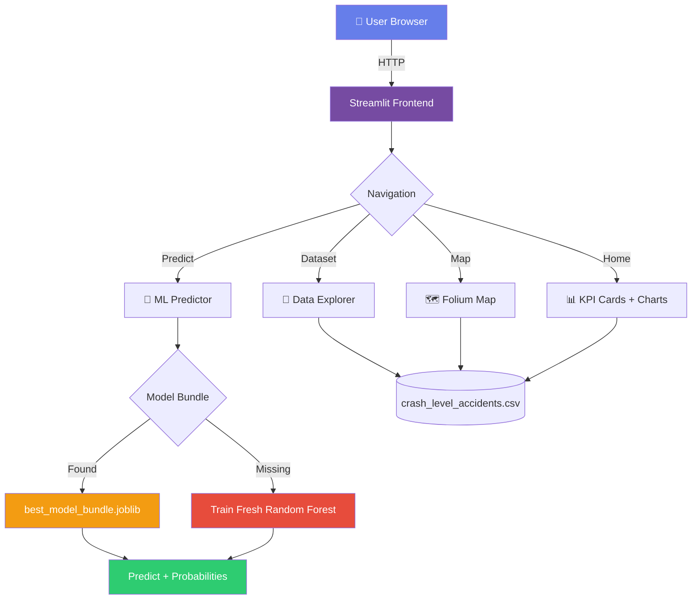
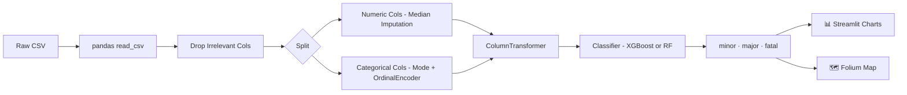
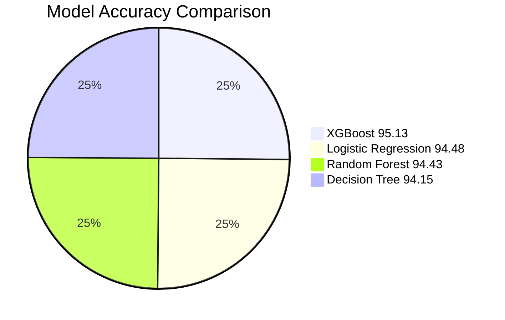
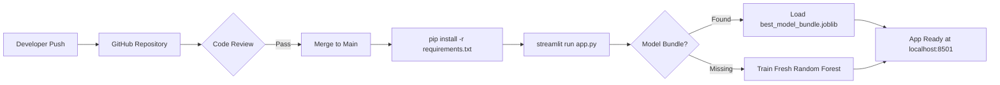

<h1 align="center">🚦 Indian Road Accident Severity</h1>
<h3 align="center">End-to-End ML System · Streamlit Dashboard · Geospatial Visualisation</h3>

<p align="center">
  
  
  
  
  
  
</p>

<p align="center">
  <a href="https://github.com/tayade-aniket/indian_road_accident_severity">
    
  </a>
  <a href="https://github.com/tayade-aniket/indian_road_accident_severity/fork">
    
  </a>
</p>

---

## 📌 Table of Contents

| # | Section |
|---|---------|
| 1 | [Problem Statement](#-problem-statement) |
| 2 | [Live Demo & Features](#-live-demo--features) |
| 3 | [Tech Stack](#-tech-stack) |
| 4 | [Project Architecture](#-project-architecture) |
| 5 | [Data Pipeline](#-data-pipeline) |
| 6 | [EDA Insights & Plots](#-eda-insights--plots) |
| 7 | [Model Comparison](#-model-comparison) |
| 8 | [Top Risk Factors](#-top-risk-factors) |
| 9 | [Dataset Schema](#-dataset-schema) |
| 10 | [Quick Start](#-quick-start) |
| 11 | [Project Structure](#-project-structure) |
| 12 | [Troubleshooting](#-troubleshooting) |
| 13 | [Author](#-author) |

---

## 🎯 Problem Statement

> **India records nearly 5 lakh road accidents every year — that is one accident every 60 seconds.**

In 2023 alone, over **1.68 lakh lives were lost** on Indian roads — more than **400 fatalities per day**, costing the economy **₹1.47 lakh crore (3.14% of GDP)**.

Raw accident data exists but is buried in government PDFs and Excel files with no actionable interface. This project solves that by:

- 🤖 **Predicting severity** (Minor / Major / Fatal) from contextual accident features using ML
- 🗺️ **Mapping crash hotspots** across India interactively
- 📊 **Visualising patterns** by state, weather, time, road type, and vehicle type
- 🔮 **Serving real-time predictions** via a Streamlit web interface

---

## ✨ Live Demo & Features

### App Pages

| Page | Icon | What It Does |
|------|------|-------------|
| **Home** | 🏠 | KPI cards, severity distribution charts, methodology overview |
| **Dataset Explorer** | 📂 | Browse 20k+ crash records, column stats, missing-value audit |
| **Predict Severity** | 🔮 | Enter accident parameters → instant ML severity prediction with probability bars |
| **India Accident Map** | 🗺️ | Interactive Folium map with colour-coded (🟢 Minor · 🟠 Major · 🔴 Fatal) markers |

### Key Capabilities

- ✅ Multi-class classification — Minor · Major · Fatal
- ✅ Pre-trained XGBoost model with **95.1% accuracy** loaded via `joblib`
- ✅ Fallback training — if model file is missing, trains a fresh Random Forest in-app
- ✅ Interactive Folium map — zoom, click, filter by severity
- ✅ Downloadable filtered data as CSV
- ✅ Fully responsive Streamlit layout

---

## 🛠 Tech Stack

| Category | Tools |
|----------|-------|
| **Web Framework** | Streamlit 1.28 |
| **ML Models** | XGBoost · Random Forest · Logistic Regression · Decision Tree |
| **Data Processing** | Pandas 2.0 · NumPy 1.24 |
| **Visualisation** | Plotly 5.17 · Matplotlib 3.7 · Seaborn 0.12 · Folium |
| **ML Pipeline** | scikit-learn 1.3 (Pipeline · ColumnTransformer · OrdinalEncoder) |
| **Model Persistence** | Joblib |
| **Geospatial** | Folium · streamlit-folium |
| **Environment** | python-dotenv · tqdm |

---

## 🏗 Project Architecture



---

## 🔄 Data Pipeline



### Preprocessing Summary

| Step | Strategy |
|------|----------|
| **Missing Numeric Values** | Median imputation |
| **Missing Categorical Values** | Most-frequent (mode) imputation |
| **Categorical Encoding** | `OrdinalEncoder` with `unknown_value = -1` |
| **Train / Test Split** | 80% / 20% — stratified by severity class |
| **Class Imbalance** | `class_weight="balanced"` in Random Forest |
| **Pipeline** | scikit-learn `Pipeline` + `ColumnTransformer` |

---

## 📊 EDA Insights & Plots

### 1 · Severity Distribution


### 2 · Severity by Weather Condition


### 3 · Severity by Route Category


### 4 · Severity by Primary Cause


### 5 · Speed Distribution by Severity


### 6 · Severity by Vehicle Type


### 7 · Crashes by Hour of Day


### 8 · Correlation Heatmap


### 9 · Model Confusion Matrix


### 10 · Feature Importance


### 11 · Numeric Correlation Heatmap


### 12 · Speed vs Severity


### 13 · Age vs Severity


### 14 · Geographic Hotspots


### 15 · Top Risk Factors


---

## 🤖 Model Comparison

> All models trained on 80/20 stratified split — ~20,000 records, 49 features.

| 🏆 Rank | Model | Accuracy | Precision (macro) | Recall (macro) | F1 (macro) | F1 (weighted) | ROC-AUC (OvR) |
|---------|-------|----------|--------------------|----------------|------------|---------------|---------------|
| 🥇 1 | **XGBoost** | **95.13%** | **94.06%** | **93.97%** | **94.01%** | **95.13%** | **99.44%** |
| 🥈 2 | Logistic Regression | 94.48% | 92.61% | 94.06% | 93.30% | 94.51% | 98.98% |
| 🥉 3 | Random Forest | 94.43% | 92.78% | 93.91% | 93.32% | 94.46% | 99.25% |
| 4 | Decision Tree | 94.15% | 92.11% | 94.00% | 92.99% | 94.19% | 98.33% |

> **Winner: XGBoost** — highest accuracy (95.13%) and best ROC-AUC (99.44%). Deployed as `best_model_bundle.joblib`.

### Model Accuracy Visual



---

## 🔑 Top Risk Factors

Feature importances from the trained XGBoost model:

| Rank | Feature | Importance | Interpretation |
|------|---------|------------|----------------|
| 1 | `high_speed_flag` | **55.84%** | Speeding is the single largest predictor of fatal outcomes |
| 2 | `mean_speed_at_impact_kmph` | 13.73% | Average impact speed strongly correlates with severity |
| 3 | `max_speed_at_impact_kmph` | 3.46% | Peak speed at crash point |
| 4 | `min_speed_at_impact_kmph` | 2.10% | Even minimum speeds matter in multi-vehicle crashes |
| 5 | `airbag_deployed_flag_mean` | 1.40% | Airbag deployment indicates high-energy collisions |
| 6 | `dominant_vehicle_type = car` | 0.98% | Vehicle category affects injury patterns |
| 7 | `occupant_record_count` | 0.90% | More occupants → more potential casualties |
| 8 | `total_occupants_in_crash` | 0.78% | Crash-level occupant count |
| 9 | `primary_cause = drunk_driving` | 0.31% | DUI significantly raises severity risk |
| 10 | `state = Telangana` | 0.29% | Geographic hotspot state |

> **Key Insight:** Speed-related features account for ~75% of total model importance — reinforcing that **speed control is the single highest-leverage road-safety intervention**.

---

## 📋 Dataset Schema

### Main Crash-Level Table (`crash_level_accidents.csv`)

| Column | Type | Description |
|--------|------|-------------|
| `crash_ref_id` | str | Unique crash identifier |
| `city_name_first` | cat | City where crash occurred |
| `state_name_first` | cat | State (multiple states covered) |
| `weekday_name_first` | cat | Day of the week |
| `route_category_first` | cat | Highway · Urban · Rural |
| `weather_condition_first` | cat | Clear · Rain · Fog · Cloudy |
| `visibility_level_first` | cat | High · Medium · Low |
| `congestion_level_first` | cat | High · Medium · Low |
| `road_surface_condition_first` | cat | Dry · Wet · Damp · Flooded · Damaged |
| `primary_cause_first` | cat | Overspeeding · Drunk Driving · Distraction · Poor Road · Weather |
| `dominant_vehicle_type_first` | cat | Car · Truck · Two-Wheeler · Auto · Bus |
| `mean_speed_at_impact_kmph` | num | Average speed across crash vehicles (km/h) |
| `high_speed_flag` | num | Binary: 1 if speed exceeds safe threshold |
| `airbag_deployed_flag_mean` | num | Proportion of vehicles with deployed airbags |
| `occupant_record_count` | num | Number of occupant records in crash |
| `total_occupants_in_crash_first` | num | Total people involved |
| `alcohol_suspected_flag_first` | num | Binary: alcohol suspected |
| `is_night_time_first` | num | Binary: crash occurred at night |
| `hour_of_day_first` | num | Hour of day (0–23) |
| `incident_month_first` | num | Month (1–12) |
| **`crash_severity_first`** | **TARGET** | **minor · major · fatal** |

### Severity Class Definitions

| Class | Colour Code | Description |
|-------|-------------|-------------|
| 🟢 **minor** | `#2ecc71` | Property damage only or minor injuries — no hospitalisation |
| 🟠 **major** | `#f39c12` | Serious injuries requiring hospitalisation |
| 🔴 **fatal** | `#e74c3c` | One or more fatalities in the crash |

---

## 🚀 Quick Start

### Prerequisites

- Python **3.9+**
- pip

### Step 1 — Clone the Repository

```bash
git clone https://github.com/tayade-aniket/indian_road_accident_severity
cd indian_road_accident_severity
```

### Step 2 — Create a Virtual Environment *(recommended)*

```bash
# Windows
python -m venv venv
venv\Scripts\activate

# macOS / Linux
python -m venv venv
source venv/bin/activate
```

### Step 3 — Install Dependencies

```bash
pip install -r requirements.txt
```

### Step 4 — Run the App

```bash
streamlit run app.py
```

Opens automatically at **http://localhost:8501** 🎉

### Step 5 — Use a Different Port *(optional)*

```bash
streamlit run app.py --server.port 8502
```

---

## 📁 Project Structure

```
indian_road_accident_severity/
│
├── app.py                              # 🚀 Main Streamlit application (1141 lines)
├── requirements.txt                    # 📦 All Python dependencies
├── README.md                           # 📖 This file
├── .gitignore                          # 🔒 Git ignore rules
│
├── data/
│   ├── raw/                            # Original unprocessed data files
│   └── processed/
│       └── crash_level_accidents.csv   # ✅ Main dataset (~20k records, 49 features)
│
├── models/
│   ├── best_model_bundle.joblib        # 🏆 XGBoost pipeline (95.1% accuracy)
│   └── decision_tree_severity.joblib   # Decision Tree baseline model
│
├── outputs/
│   ├── confusion_matrix_best_model.png # Model evaluation plot
│   ├── risk_factor_importance.csv      # All 115 feature importances
│   └── metrics/
│       └── model_comparison.csv        # Accuracy/F1/AUC for all 4 models
│
└── eda_plots/                          # 25 EDA and model visualisation plots
    ├── 01_severity_distribution.png
    ├── 02_severity_by_weather.png
    ├── ...
    └── 15_top_risk_factors.png
```

---

## 🔧 Troubleshooting

| Error | Fix |
|-------|-----|
| `ModuleNotFoundError` | Run `pip install -r requirements.txt` — ensure venv is activated |
| Blank page on load | Refresh browser · Restart: `Ctrl+C` then `streamlit run app.py` |
| Dataset not found | Ensure `data/processed/crash_level_accidents.csv` exists |
| Model file missing | App auto-trains a fresh Random Forest — no action needed |
| File upload fails | Use `.csv` (UTF-8) or `.xlsx` — remove blank header rows |
| Charts not rendering | Update Plotly: `pip install plotly --upgrade` |
| Port already in use | `streamlit run app.py --server.port 8502` |
| Slow on large files | Pre-sample data to fewer than 50k rows before uploading |

---

## 🔁 CI / Workflow



---

## 🤝 Contributing

1. Fork the repository
2. Create a feature branch: `git checkout -b feature/your-feature`
3. Commit your changes: `git commit -m "feat: add your feature"`
4. Push to the branch: `git push origin feature/your-feature`
5. Open a **Pull Request**

---

## 📜 License

This project is licensed under the **MIT License**.

---

## 👤 Author

<table>
  <tr>
    <td align="center">
      <b>Aniket Tayade</b><br/>
      <i>Machine Learning Engineer · Data Scientist</i><br/><br/>
      <a href="https://github.com/tayade-aniket">
        
      </a>
      <br/><br/>
      
      &nbsp;
      
    </td>
  </tr>
</table>

> *"Data-driven road safety — because every statistic is a life that could have been saved."*

---

<p align="center">
  Made with ❤️ in India &nbsp;|&nbsp; Star ⭐ this repo if it helped you!
</p>

<p align="center">
  
</p>
